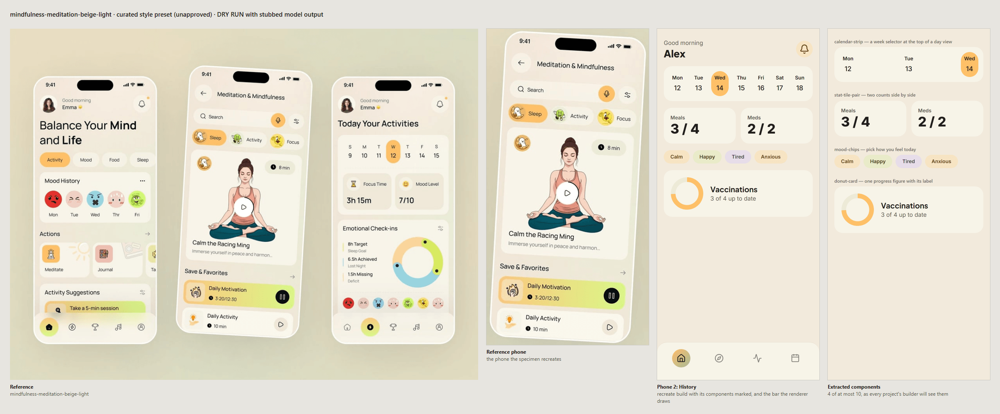

# After Step 1: curated style presets

Step 1 is the infrastructure for presets and the tool that builds them. **No preset has been built or approved**, so a generation today runs exactly as it did before this step. Building one needs a model run, and approving one needs you to look at it, so both are yours to do. The plan's "done when" (the mindfulness preset approved, and the pet project rebuilt on the harness using its components and navigation) waits on that.

[`docs/curated-style-presets.md`](../../curated-style-presets.md) explains what a preset holds, how a run uses one, and how to build and approve one. In short:

```bash
pnpm curated:presets --id mindfulness-meditation-beige-light   # builds it, unapproved, with a preview
# look at scripts/curated/out/mindfulness-meditation-beige-light.png
pnpm curated:presets --approve mindfulness-meditation-beige-light
pnpm design:eval --project 0ce99a06 --label step1 --case pets-family   # after regenerating the pet project
```

## What the review sheet looks like



This is the sheet the build writes for you to approve, made here from the real mindfulness image with **stubbed model output**: a hand-written specimen and the fixture tokens, standing in for the model's. It is an example of the format, not a preset. Left to right: the reference, the phone the specimen recreates, the specimen, and the extracted components drawn with the preset's tokens as every builder will copy them. The specimen's bottom bar is left out of the components, because the renderer draws the navigation. The specimen is drawn with that bar, built from the preset's navigation with sample destinations (Step 6 added it to the sheet), so the preset's navigation can be checked by looking.

## What is checked without a model

| Behaviour | Test |
| --- | --- |
| The preset schema accepts a complete preset, and rejects one that misses a phone or a box, does not classify radius and elevation, has a card radius over 24px, lacks a card or a heading font, was not measured, has unknown navigation, or has too many or too large components | `curated-style-presets.test.ts` |
| A malformed entry does not take the others with it; a preset is used only when approved and built from the catalogue entry as it is now; editing the entry makes it stale | `curated-style-presets.test.ts` |
| The check's report: approved, unapproved, stale, malformed, none, and presets that belong to no entry | `curated-style-presets.test.ts`, and `pnpm run curated:styles:check` on the real catalogue |
| With an approved preset the model mock sees **no analysis, creative-direction or token call** when the user named no colours or fonts, for the analysis, the tokens and the early project design | `curated-preset-runtime.test.ts` |
| With colours named: one token call with the preset's analysis and measured palette as evidence, the user's roles from its answer, the preset's radii, shadows and type; with fonts named, the model's families | `curated-preset-runtime.test.ts` |
| Every other reference, an uploaded reference, Image to UI and the preset builder itself take the run-time path | `curated-preset-runtime.test.ts` |
| The project's reference DNA carries the preset's components to every later batch, and none for a reference without a preset | `curated-preset-runtime.test.ts` |
| The reference's navigation builds the shared navigation the way the reference's bar is built | `curated-preset-runtime.test.ts` |
| A prepared design made before a preset was approved, or before it was rebuilt, is not reused | `project-design-preparation.test.ts` |
| The build orchestration: the order of the steps, the specimen phone, the crop, the palette from the real image; and every refusal: a salvaged analysis, a count mismatch, a phone without a box, missing classes, validation issues, no marked component, tokens over the radius rule, an unmeasurable palette | `curated-preset-builder.test.ts` |
| Reading components out of a specimen: one instance per name, cleaned, sampled text, repeats trimmed, oversized ones skipped with a reason, the status bar and navigation left out, at most ten | `style-component-extraction.test.ts` |
| Writing a built preset unapproved, approving only a complete and current one, the file's key order | `curated-preset-builder.test.ts` |
| The preview sheet | `scripts/curated/preview.test.ts` |

## Choices that differ from the plan's wording

- **Components are read out of the specimen with cheerio, not jsdom.** It is the HTML library the app already ships and types; jsdom is a test dependency without types.
- **"Seeded with the preset" is a code merge.** When the user named colours, the token model runs as it always has, and the preset then supplies everything but the roles they named. A model asked to edit a token set can drift its geometry; the merge cannot.
- **The preset is picked where the analysis and the tokens are made** (`analyzeReferenceImageForScope`, `generateDesignTokens`), not at each of the five places that call them, so none of them can miss it.
- **The hash is per catalogue entry**, not the index's whole-catalogue hash, which changes whenever any entry is added.
- **`referenceDna.specimen`** (added in Step 4) is how the components reach every batch.
