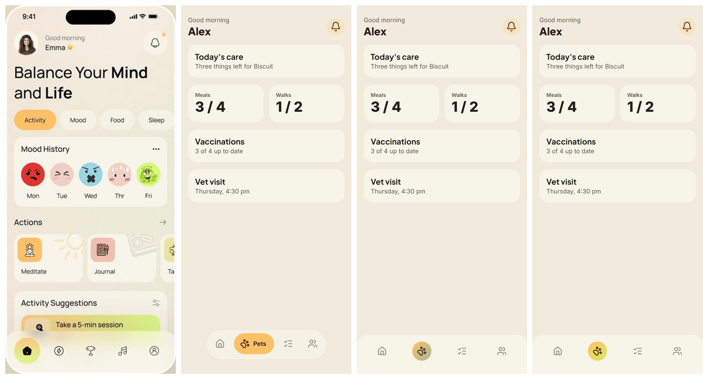

# After Step 6: navigation is decided in the approved flow

Whether a product has persistent navigation is now part of the screen flow the person approves. The discovery designer decides it with the screens, the approval card shows it (**Bottom navigation: Today · Pets · Routines · Family**, or **No bottom navigation**), and generation builds exactly that. The hidden heuristic that contradicted the discovery designer on the pet project only runs for a flow approved before this step.

Nothing here needed a live model to check, so all of it is tested. What a real discovery designer decides for a real request is not checked (see the end).

## What the renderer draws now

Left to right: the reference's left phone, the bar the planner drew by default (a floating glass dock with a labelled chip), the bar built from the reference's evidence through `applyReferenceNavigationStyle`, and the same bar under tokens that carry the reference's gradient. Rendered with `scripts/design-eval` at 390×844, 2×.

The third bar's circle is muddy only because the fixture's tokens (made up for the tests) pair the yellow with a sage. The action gradient is `gradients.action_primary`, which the token model is asked to write from the reference, so a built preset draws the fourth. The circle takes whatever gradient the tokens carry.

The bar is icon-only, attached, rounded at the top, with the active item in a gradient circle:

- `NavigationDesignContract.activeFill: "solid" | "gradient"`. The renderer draws the active item with `--dg-gradient-action-primary` when it is `gradient` (the active circle, a chip, the underline and the centre action; not a tint). Solid is the default and is never written, so stored plans are unchanged.
- The reference analysis reads two more things in the renderer's own vocabulary: `activeFill`, and `corners` (`square | rounded`, only for a bar attached to the bottom edge). Code turns `rounded` into a 24px top radius. The model classifies, code owns the px. Presets carry both.
- An attached bar rounds its **top** corners only and is now **flush with the bottom edge**: its surface runs to the edge and the home indicator's room is padding inside it. Before, it floated 20px above the edge with the page showing under it.
- An icon-only attached bar draws its icons at 22px or more in a circle twice their size.
- When the reference's bar is built another way than the planner's, the planner's safe-area offset, gaps, icon size, border and shadow are replaced by the new anatomy's defaults. A dock's 16px offset would have floated the attached bar.
- The preset review sheet now draws the bar the renderer will build under the specimen (the specimen's own bar is replaced, as it is in a project), so a preset's navigation can be approved by looking. [`review-sheet-example.png`](../after-step-1/review-sheet-example.png) is updated.

## What is checked without a model

| Behaviour | Test |
| --- | --- |
| **A 2-root approved flow with `persistent: true` keeps its bar**, though the planner's own rules drew none; **an approved `false` stays none**, though the planner drew four destinations | `approved-navigation-plan.test.ts` (runs the real planner with a model that answers as the old heuristics did) |
| The approved bar is valid by construction: no navigation repair call, two planning calls | `approved-navigation-plan.test.ts` |
| A screen the bar opens is a root screen with the bar, whatever the brief planner called it; a destination with no screen in the flow is planned, and no screen is invented | `approved-navigation-plan.test.ts` |
| The planner is told the approved destinations as binding input, and only supplies each one's icon and role | `approved-navigation-plan.test.ts`, `approved-navigation.test.ts` |
| A flow approved before navigation was decided in it keeps the planner's decision and the older rules | `approved-navigation-plan.test.ts` |
| A later batch keeps its saved bar while that is what was approved, and follows a newer approval that decides it differently | `approved-navigation-plan.test.ts` |
| `enforceNavigationEvidencePolicy` passes an approved decision through, and does not take a model's claim of approval for the approval | `service-navigation-evidence.test.ts` |
| The proposal asks for the decision with the screens; the response schema requires it; a missing or unreadable one leaves the flow undecided; a bar needs two distinct, named destinations; a screen is opened by one destination only; a destination whose screen is not part of this build is planned | `proposal-response.test.ts`, `proposal-candidate.test.ts`, `proposal-runner.test.ts` |
| A changed navigation is a change to the flow (a new content revision), an unchanged one is not; the decision survives the saved planning state | `proposal-runner.test.ts`, `model.test.ts` |
| The approval card shows the bar and which of its areas come later, says so when there is none, and says nothing for a flow that never decided | `ProductScopeCard.test.tsx` |
| Prepared plans are not reused after the approved navigation changes; a scope without one keeps its key | `scope-preparation.test.ts`, `production-fixes.test.ts` |
| A bar the person approved keeps two destinations (a planner's needs three), is read back from storage with its evidence, and an approved "none" keeps the evidence that it was decided | `navigation.test.ts` |
| The icon-only attached bar: layout, rounded top, flush edge, hidden labels, the circle, solid and gradient fills, sizes; a dock is untouched | `navigation.test.ts` |
| The reference's evidence builds the bar: fill and corners read (with aliases), a dock's radius never changed by an attached bar's corners, the dock's offset not carried onto an attached bar | `navigation.test.ts` |
| The review sheet draws the bar the renderer builds, once, replacing the specimen's own | `scripts/curated/preview.test.ts` |

## Choices that differ from the plan's wording

- **`screenKey` is set only for a screen in the approved flow** (selected now, or already built). A screen that is on the roadmap but not part of this build is planned, like one that does not exist yet. That keeps the approved scope self-contained: everything it says can be checked against its own manifest.
- **A persistent bar needs two destinations**, one fewer than a planner-chosen bar (three). The person saw the list on the card, so two peer areas are enough. A response that says persistent with fewer than two named destinations is read as no bar.
- **The approval is the evidence, a claim of it is not.** `evidence.source: "approved-scope"` survives the evidence policy only when the scope carries the decision.
- **Icons come from the planner.** The proposal decides labels and screens; the blueprint planner, which has the design context, picks each destination's Lucide icon and role. A destination the planner did not draw gets the neutral `circle` icon, which only happens when the planner ignored the binding input.
- **The decision also governs later batches.** If a newer approved flow decides the bar differently from the saved one, the approved decision wins; if it matches, the saved bar (and any design edits made to it) stays.
- **The other renderer changes** (flush attached bar, larger icon-only circle, the new anatomy's defaults) come from looking at the bar on the harness beside the reference; they are what made it read as the reference's.

## Not checked

- **A real discovery designer's decisions.** The prompt says to decide from the product and its screens, never from a visual reference, and to keep `currentNavigation` unless the conversation changed it. Whether it does so well on the eval prompts needs a live run.
- **The pet project on the harness.** It has to be regenerated to have an approved flow; its stored screens were built with no room for a bar, so a what-if on them would not be a fair picture.
- **A later batch's links.** The batch's navigation is normalized against that batch's screens only, so a destination that opens a screen built in an earlier batch comes out as planned. That is how a saved bar already behaves, as far as I can tell from the code, and I did not change it.
